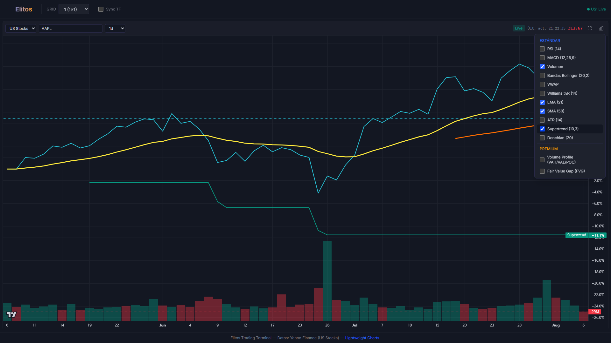

# Elitos Trading Terminal

Terminal de trading visual estilo cyberpunk/minimalista construida con **Vite + React 19**, **lightweight-charts v5** y backend **Flask + pandas/numpy**.

## Características

### ��� Gráficos
- **Serie principal**: Línea continua de **% cambio** (modo "compare") respecto a la primera vela del dataset — sin huecos entre velas
- **Volumen**: Histograma inferior con escala propia (toggle ON/OFF)
- **Overlays de precio** (5, convertidos a % con la misma base):
  - **EMA (21)** — amarillo `#FFEB3B`
  - **SMA (50)** — naranja `#FF6D00`
  - **ATR (14)** — verde neón `#00E676`
  - **Supertrend (10,3)** — verde `#089981` (uptrend) / rojo `#F23645` (downtrend)
  - **Donchian (20)** — gris `#787B86` (upper/mid/lower)
- **Indicadores en sub-panes**: RSI, MACD, Williams %R
- **Volume Profile**: POC/VAH/VAL + histograma horizontal
- **Fair Value Gaps (FVG)**: Cajas + marcadores

### ������ Funcionalidad
- Multi-panel: grids 1/2/4/6/8, responsive (mobile 1 columna)
- Maximizar panel (doble clic o botón), restaura con Esc
- Timeframes: 1m, 5m, 15m, 30m, 1h, 4h, 1d, 1w, 1M
- Mercados: US Stocks (yfinance) / Crypto (Hyperliquid WS+REST)
- Badge de mercado Live/Closed (actualizado cada 30s)
- Precio en vivo en header (stocks: última vela; crypto: WS)
- Zoom automático por ancho de panel (`DEFAULT_BAR_SPACING = 9`)
- Refresh cada 10s (background, preserva zoom del usuario)
- Estado persistente: último precio, timestamp "Últ. act."

### ��� Estética
- Tema oscuro cyberpunk (`#131722` fondo, `#26C6DA` cyan acento)
- Tipografía Inter variable
- Scrollbars, crosshair, grid sutiles

## Captura



*Panel con EMA, SMA, Supertrend y Donchian activos sobre la línea de % cambio (AAPL 1d).*

## Stack

| Capa | Tech |
|------|------|
| Frontend | React 19, Vite, TypeScript, Tailwind CSS 4 |
| Charts | lightweight-charts v5 (ESM) |
| Backend | Flask, pandas, numpy, yfinance, Hyperliquid WS/REST |
| Dev | Playwright (E2E), Vitest-ready |

---

## ��� Despliegue

El proyecto está configurado para desplegarse en **Render**, **Vercel** o **Netlify** (ver detalles abajo). También incluye `Dockerfile` + `docker-compose.yml` para contenedores.

### Opción A: Render (Recomendado — Backend + Frontend juntos)

> Render ejecuta servidores Python persistentes (Gunicorn/Flask) y sirve archivos estáticos. Ideal para este proyecto full-stack.

1. **Push a GitHub** (rama `main` o `master`)
2. En [Render Dashboard](https://dashboard.render.com) → **New** → **Blueprint**
3. Conecta tu repo → Render detecta `render.yaml` automáticamente
4. **Deploy** — listo en ~3 min

**Lo que hace `render.yaml`:**
- Instala deps Python (`backend/requirements.txt`) + Node (`npm ci`)
- Ejecuta `npm run build` → genera `dist/`
- Inicia `python backend/app.py` en puerto 5000
- Flask sirve `dist/` en `/` y API en `/api/*`
- Health check en `/api/market-status`

**Variables de entorno en Render (Settings → Environment):**
| Variable | Valor | Notas |
|----------|-------|-------|
| `FLASK_ENV` | `production` | |
| `LOG_LEVEL` | `INFO` | |
| `PORT` | `5000` | Auto-inyectado por Render |

**URL final:** `https://elitos-trading-terminal.onrender.com` (o tu nombre personalizado)

---

### Opción B: Vercel (Frontend + Serverless Functions)

> Vercel ejecuta el frontend estático y la API como **Python Serverless Functions** (máx 30s/req). Buena para tráfico bajo/medio.

1. Push a GitHub
2. En [Vercel Dashboard](https://vercel.com/dashboard) → **Add New** → **Project**
3. Importa el repo → Vercel detecta `vercel.json` + `package.json` (Vite)
4. **Deploy**

**Configuración (`vercel.json`):**
- `buildCommand: npm run build` → output en `dist/`
- `functions: backend/app.py` → runtime Python 3.11, max 30s
- Rewrites: `/api/*` → serverless function
- Headers de seguridad incluidos

**Variables de entorno en Vercel (Settings → Environment Variables):**
| Variable | Valor | Notas |
|----------|-------|-------|
| `VITE_API_URL` | *(vacío)* | Mismo origen — functions en `/api/*` |

**URL final:** `https://elitos-trading-terminal.vercel.app`

> ������ **Limitación:** Serverless functions tienen cold starts (~1-2s) y timeout 30s. Para WebSockets (Hyperliquid live) usa Render o Fly.io.

---

### Opción C: Netlify (Solo Frontend) + Backend Externo

> Netlify **no** ejecuta servidores Python persistentes. Despliega solo el frontend y apunta la API a un backend en Render/Railway/Fly.io.

#### 1. Despliega el Backend (Render/Railway/Fly.io)
```bash
# Render: usa el mismo render.yaml pero como "Web Service" solo backend
# Railway: railway up (detecta Python automáticamente)
# Fly.io: fly launch (genera fly.toml)
```
Obtén la URL pública: `https://elitos-api.onrender.com`

#### 2. Despliega Frontend en Netlify
1. Push a GitHub
2. En [Netlify Dashboard](https://app.netlify.com) → **Add new site** → **Import from Git**
3. Build settings (auto-detectados por `netlify.toml`):
   - Build command: `npm run build`
   - Publish directory: `dist`
4. **Environment variables** (Site settings → Environment variables):
   | Variable | Valor |
   |----------|-------|
   | `VITE_API_URL` | `https://elitos-api.onrender.com` |
5. **Deploy**

**URL final:** `https://elitos-trading-terminal.netlify.app`

> �� Netlify hace proxy de `/api/*` a `VITE_API_URL` si configuras el redirect en `netlify.toml` (descomenta la sección `[[redirects]]`).

---

### Opción D: Docker (Cualquier VPS / Cloud Run / Fly.io / Railway)

```bash
# Build
docker build -t elitos-trading-terminal .

# Run local
docker run -p 5000:5000 -e FLASK_ENV=production elitos-trading-terminal

# O con docker-compose (dev con hot reload)
docker compose up --build
# Acceso: http://localhost:5000
```

**Plataformas compatibles:**
- **Google Cloud Run**: `gcloud run deploy --source . --port 5000`
- **Fly.io**: `fly launch` (genera `fly.toml` basado en `Dockerfile`)
- **Railway**: `railway up` (detecta `Dockerfile`)
- **DigitalOcean App Platform**: Spec `dockerfile_path: Dockerfile`
- **AWS ECS / Fargate**: Usa la imagen del registry

---

## ��� Desarrollo Local

```bash
# Backend (puerto 5000)
cd backend
python -m venv venv
source venv/bin/activate  # Windows: .\venv\Scripts\activate
pip install -r requirements.txt
python app.py

# Frontend (puerto 5001) — en otra terminal
cd ..
npm install
npm run dev
```

Abre `http://localhost:5001`. El proxy de Vite reenvía `/api/*` a `localhost:5000`.

### Variables de entorno local

Copia `.env.example` a `.env.local` y ajusta:
```bash
cp .env.example .env.local
```

| Variable | Dev | Producción |
|----------|-----|------------|
| `VITE_API_URL` | *(vacío)* | `https://tu-backend.com` |
| `PORT` | `5000` | Auto (Render) / 5000 (Docker) |
| `FLASK_ENV` | `development` | `production` |

---

## ��� Estructura

```
├── backend/
│   ├── app.py              # Flask API + serve static dist/ en prod
│   ├── indicators.py       # RSI, MACD, Bollinger, VWAP, EMA, SMA, ATR, Supertrend, Donchian, VP, FVG
│   └── data_sources.py     # yfinance (stocks) + Hyperliquid WS/REST (crypto)
├── src/
│   ├── components/
│   │   ├── ChartPanel.tsx  # Panel principal (lightweight-charts v5, compare mode)
│   │   ├── FVGPrimitive.ts # Canvas primitive para cajas FVG
│   │   └── VolumeProfilePrimitive.ts
│   ├── services/api.ts     # Fetch wrappers (usa VITE_API_URL)
│   ├── types.ts            # Tipos compartidos (PanelConfig, ChartIndicators, etc.)
│   └── App.tsx             # Grid, estado global, routing de paneles
├── dist/                   # Build de producción (generado por npm run build)
├── verify-final.mjs        # Suite E2E Playwright (58 tests)
├── render.yaml             # Render Blueprint
├── vercel.json             # Vercel config
├── netlify.toml            # Netlify config (frontend only)
├── Dockerfile              # Multi-stage build
├── docker-compose.yml      # Dev local con Docker
��── .env.example            # Template de variables de entorno
```

---

## �� Tests E2E

```bash
# Terminal 1: backend
cd backend && python app.py

# Terminal 2: frontend
npm run dev

# Terminal 3: tests
node verify-final.mjs    # 58 tests Playwright (headless Edge)
```

Cubre: grid/layout, zoom, overlays, indicadores, refresh, maximizar, mobile, right-margin, header price.

---

## ��� Licencia

MIT — libre para uso personal y comercial.